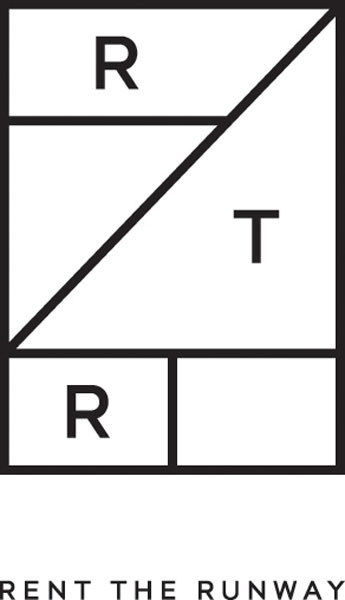

# Whose-Clothes-Fit-Well
## Team members: [Clifford Bridges](https://github.com/CliffordBridges) and [Allan Kim](https://github.com/allankim4)

## Executive summary:

The goal of this project is to perform tests and identify statistical significance on the datasets acquire. 
Listed below are the companies where data was indirectly taken from. 
(Data sets were retreived from kaggle) 




## Contents

- [Introduction](#Introduction)
    - [Problem statement](#Problem-statement)
    - [Dataset](#Dataset)
- [Analysis](#Analysis)
    - [Data Cleaning](#Data-Cleaning)
    - [Exploratory Data Analysis](#Exploratory-Data-Analysis)
    - [Statistical Tests](#Statistical-Test)
- [Responsibilties](#Responsibilities)
- [Summary of Files](#Files-summary)


## Introduction

### Dataset
Downloaded user review data from [kaggle](https://www.kaggle.com/rmisra/clothing-fit-dataset-for-size-recommendation). 
This data includes [Rent The Runway](https://www.renttherunway.com/) data and [ModCloth](https://www.modcloth.com/) data on user reviews, each in a separate file.

## Analysis

### Data Cleaning
Files were very clean directly from Kaggle. 
For example, in Rent The Runway (RTR) file, less than 2\% of values from the columns explored were ```NaN``` types. 
There were several features engineering steps, however. 
For example, the values in the column, ```bust size```, were strings, from which we created two columns ```band_size``` and ```cup_size``` where ```band_size``` values were ints and ```cup_size``` values were strings. 
<<<<<<< HEAD
All cleaning is described in the RTR_DataCleaning notebook.


### Exploratory Data Analysis
The [Tecnical Notebook](Technical_Notebook.ipynb) contains all of the analysis for both data sets. 
Note that the technical notebook comments out the lines used to save the figures produced as a separate file. 
The reader can uncomment to save the figure locally.

### Statistical Tests

Two tailed test were conducted in the modcloth data sets. The distribution of the chosen feautre was tested to be not normal reulsting to bootstrap resampling. Once all the features are normally distriuted, two tailed t-test were conducted.

## Responsibilities

With two datasets for this project, We decided to assign each a dataset and conduct our own test and exploration. Throught out the testing and exploration of the data, the workloads were similar aside from subject matter expert advise/insight burden was given to Clifford.

The presentation file was a joint combined effort.

## Summary of Files

The cleaned files ([cleaned RTR data](rtr_clean.csv) and [cleaned ModCloth data](modcloth_finaldata.json)) were the final data sets used for analysis.

Images folder contains images used for the presentation which were created from the EDA and Resampling.

RTR_DataCleaning notebook entails the process of cleaning the data.

>>>>>>> afceb7a031822dd830b72c4150d6715e3a4f02d5
