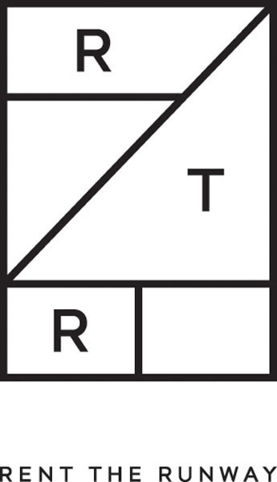

# Whos-Clothes-Fit-Well
## Team members: [Clifford Bridges](https://github.com/CliffordBridges) and [Allan Kim](https://github.com/allankim4)

## Executive summary:

The goal of this project is to perform tests and identify statistical significance on the datasets acquire. 
Listed below are the companies where data was indirectly taken from. 
(Data sets were retreived from kaggle) 




## Contents

- [Introduction](#Introduction)
    - [Problem statement](#Problem-statement)
    - [Dataset](#Dataset)
- [Analysis](#Analysis)
    - [Data cleaning](#Data-Cleaning)
    - [Exploratory data analysis](#Exploratory-data-analysis)
- [Responsibilties](#Responsibilities)
- [Summary of Files](#Files-summary)


## Introduction

### Dataset
Downloaded user review data from [kaggle](https://www.kaggle.com/rmisra/clothing-fit-dataset-for-size-recommendation). 
This data includes [Rent The Runway](https://www.renttherunway.com/) data and [ModCloth](https://www.modcloth.com/) data on user reviews, each in a separate file.

## Analysis

### Data-Cleaning
Files were very clean directly from Kaggle. 
For example, in Rent The Runway (RTR) file, less than 2\% of values from the columns explored were ```NaN``` types. 
There were several features engineering steps, however. 
For example, the values in the column, ```bust size```, were strings, from which we created two columns ```band_size``` and ```cup_size``` where ```band_size``` values were ints and ```cup_size``` values were strings. 
All cleaning is described in the RTR_DataCleaning notebook.
